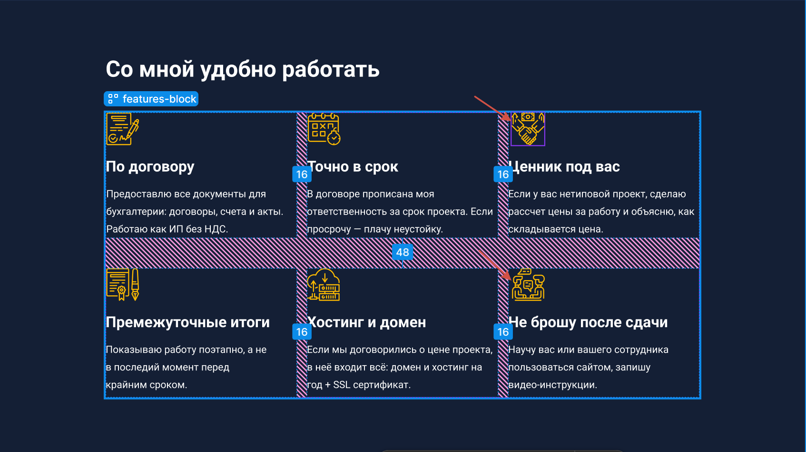

# Яндекс практикум - challenge "Keanu freelancer"

## Содержание

- [Обзор](#обзор)
  - [Задача](#задача)
  - [Ссылки](#ссылки)
- [Мой процесс](#мой-процесс)
  - [Использованные технологии](#использованные-технологии)
  - [Чему я научился](#чему-я-научился)

## Обзор

### Задача

Написать проект максимально близко к дизайн-макету.
Реализовал: mobile и desktop
Адаптивная вёрстка.

### Ссылки

- URL живого сайта: [Ссылка на живой сайт](https://vimanshin.github.io/keanu-freelancer-fd/)

## Мой процесс

### Использованные технологии

- HTML5 — семантическая разметка (`<header>`, `<main>`, `<section>`, `<article>`, `<nav>`, `<form>`)
- SCSS — архитектура с партиалами, BEM, `@use` вместо `@import`
- CSS Flexbox и Grid — управление макетом
- Mobile-first подход — три брейкпоинта: 320px → fluid → 1280px
- Figma — изучение дизайн-макета и работа с токенами

### Чему я научился

**Fluid-типографика** через `clamp()`: вместо двух жёстких размеров — один плавный диапазон между мобилем и десктопом.

**CSS Grid для нетривиальных layout**: решил задачу «два элемента рядом + один прижат к низу колонки» через `grid-template-rows: auto auto 1fr` и `align-self: end` — без лишней HTML-обёртки.

**Порядок правил в SCSS имеет значение**: `@include respond(desktop)` должен стоять в конце блока. Если медиа-запрос оказывается раньше мобильных стилей в скомпилированном CSS — базовые стили перекрывают адаптивные, несмотря на `min-width`.

**Visually hidden pattern**: скрытие элемента от зрячих пользователей с сохранением для скринридеров через `position: absolute; width: 1px; clip`.

**`<picture>` для адаптивных изображений**: автоматическая замена `src` в зависимости от ширины экрана без JavaScript.

## Доработки дизйан макета

1) Есть явный баг у макета. Присутсвуют не нужные маленькие отступы от края своего блока.

2) line-height в дизайн макете = равны магическим числам. Может их привести к лучшим значениям.